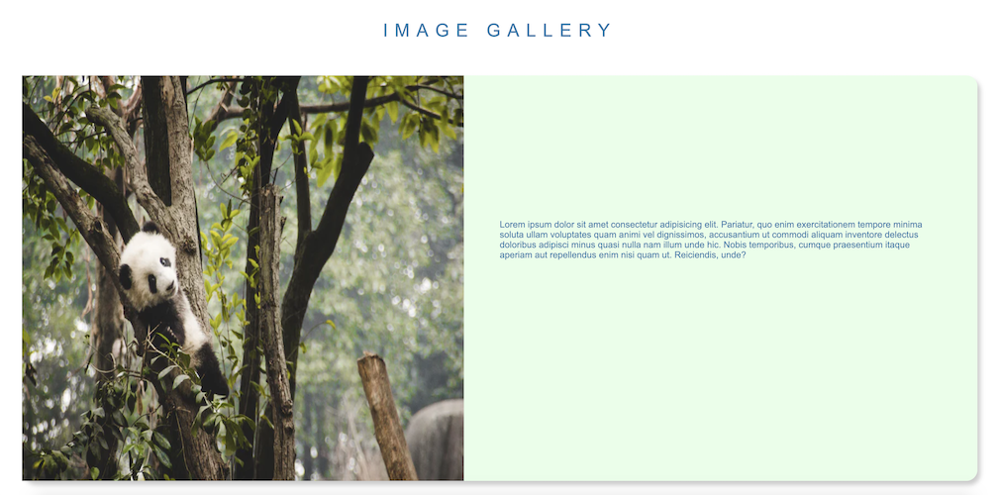
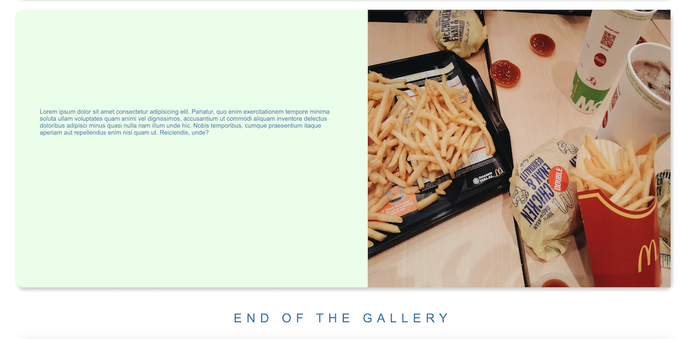

# image-gallery

Create a simple responsive image gallery.

### Desktop view




### Mobile View


## 🎯 Objective

Use CSS Flexbox to create a simple responsive image gallery, and learn how the flex container (parent) and flex items (children) work.

## ✋ Hold on...

Before starting this project, you should have an intermediate understanding of:

- HTML elements (divs, paragraphs, images, attributes, anchor tags, etc.)
- CSS (Flexbox, element selectors, border, margin, padding, pseudo-classes, etc.)

## ⚒️ Let's Build

### Part 1 - File Setup

1. Create the following files:

   - index.html
   - styles.css

2. Link your CSS file to your HTML file.

### Part 2 - HTML

- Declare the HTML `!DOCTYPE`

_**NOTE: Create the HTML elements with the same nested structure as the following instructions. Here we go!**_

- In the `title`, replace the text, "Document", with "Image Gallery"

- In the `body`, create a `div` with the class name `container`.

  - `header` with the class name `item` and give it the text "IMAGE GALLERY"

  ***

  - `div` with the class name `row` four times. From this point on, we will refer to these four **divs** as **rows**.

    - In each odd **row** (first and third), create an `img` and give each `img` an `src`.
    - For each `src`, use one of the following links (I recommend using all of the images for variety. Feel free to find your own images):

    ```HTML
    https://images.unsplash.com/photo-1504713721722-f73b4ccdfe6a?ixid=MXwxMjA3fDB8MHxzZWFyY2h8MTJ8fHBhbmRhfGVufDB8fDB8&ixlib=rb-1.2.1&auto=format&fit=crop&w=800&q=60

    https://images.unsplash.com/photo-1495474472287-4d71bcdd2085?ixid=MXwxMjA3fDB8MHxzZWFyY2h8Mnx8Y29mZmVlfGVufDB8fDB8&ixlib=rb-1.2.1&auto=format&fit=crop&w=800&q=60
    ```

    - Create a `p` element after each `img` with the class name `item` and `text`, and insert the following sample text (we will be using the same sample text for all of the **rows**):

    ```HTML
    Lorem ipsum dolor sit amet consectetur adipisicing elit. Pariatur, quo enim exercitationem tempore minima soluta ullam voluptates quam animi vel dignissimos, accusantium ut commodi aliquam inventore delectus doloribus adipisci minus quasi nulla nam illum unde hic. Nobis temporibus, cumque praesentium itaque aperiam aut repellendus enim nisi quam ut. Reiciendis, unde?
    ```

    - In each even **row** (second and last), create a `p` element with the class name `item` and `text`, and insert the same sample text that we used previously for the odd **rows**.

    - Now create an `img` element for each `p` element and give each `img` an `src`.

    - In each `src`, use one of the following links:

    ```HTML
    https://images.unsplash.com/photo-1533743983669-94fa5c4338ec?ixid=MXwxMjA3fDB8MHxzZWFyY2h8N3x8Y2F0fGVufDB8fDB8&ixlib=rb-1.2.1&auto=format&fit=crop&w=800&q=60

    https://images.unsplash.com/photo-1552895638-f7fe08d2f7d5?ixid=MXwxMjA3fDB8MHxzZWFyY2h8Nzd8fG1jZG9uYWxkJ3N8ZW58MHx8MHw%3D&ixlib=rb-1.2.1&auto=format&fit=crop&w=800&q=60
    ```

  ***

  - Finally, after creating the four rows, create a `footer` with the class name of `item` and text of "END OF THE GALLERY".

### Part 3 - CSS

- Target the `body`

  - Set the background color to `#ffffff`.

- Target the class name `container`

  - Set the font to `Arial, Helvetica, sans-serif`

- Target the `header` and `footer` at the same time

  - Set the font size to `2rem`
  - Set the line height to `1`
  - Set the letter spacing to `12px`
  - Set the top and bottom margin to `5px`
  - Set the left and right margin to `5px`
  - Set the top and bottom padding to `2rem`
  - Set the left and right padding to `3rem`
  - Align the text to the center

- Target the class name `item`

  - Set the color to `#367caf`

- Target the class name `row` (parent flex containers)

  - Set the display to `flex`
  - Set the flex direction to `row`
  - Set the background color to `#b5ffbb57`
  - Set the border radius to `20px`
  - Set the box shadow to the following values:
    - Offset the x-position by `5px`
    - Offset the y-position by `7px`
    - Set the blur radius to `8px`
    - Set the color to `rgba(0, 0, 0, 0.2)`
  - Set the top and bottom margins to `2rem`
  - Set the left and right margins to `2rem`

- Target the `img` elements (child of the parent flex containers)

  - Set the flex property to `1`
  - Set the width to `720px`
  - Set the height to `720px`

- Target the class name `text` (child of the parent flex containers)

  - Set the flex property to `1`
  - Set the top and bottom padding to `15rem`
  - Set the left and right padding to `4rem`
  - Align the text to the left

- ### Part 3.1 - CSS Media Query

  - **For this project, you do not need a full understanding of media queries, I will provide you with the media query below. I recommend looking into media queries afterwards.**

  - After targeting the class name `text`, we will make a media query to create a breakpoint at 1200px (this will make our project responsive to smaller screen sizes):

  ```CSS
  @media screen and (max-width: 1200px) {

  }
  ```

  - In the media query,

    - Target the class name `row`

      - Set the flex direction to `column`
      - Center the alignment of the items

    - Target the class name `text`

      - Set the top and bottom padding to `3rem`
      - Set the left and right padding to `2rem`

    - Target the class name `text` for the odd rows
      - Set the ordering of these flex items to `2`

## 🤸 Stretch Goals

- **Change the flex properties of the child flex items:**

  - Change the images' flex properties to take up more space in the container. (Currently the images and text captions each take up half the space.)

- **Create a new version**

  - Vertically align the captions with the images where the caption is below the image.

    - For each **image-caption** pair, display them in the direction of rows.

  - Add an image hover overlay effect.

    - While the user is hovering an image, show an overlay with a button that redirects the user to the image's source link or to the [Unsplash](https://unsplash.com) home page.

- **Resources**
  - [A Guide to Flexbox](https://css-tricks.com/snippets/css/a-guide-to-flexbox)
  - [CSS Pseudo-classes](https://developer.mozilla.org/en-US/docs/Web/CSS/Pseudo-classes)
  - [Image Hover Overlay Example](https://www.w3schools.com/howto/howto_css_image_overlay.asp)
